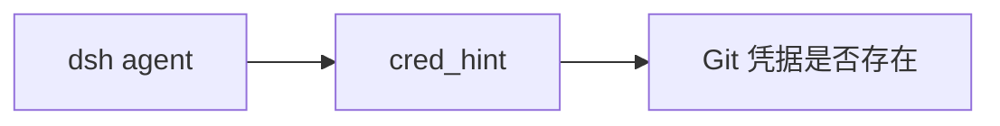

# dsh-wsl-cred
> **套件安装：** 见 [dsh-wsl-kit](https://github.com/173787247/dsh-wsl-kit)。推荐 `KIT_SET=daily` | `llm` | `github` | `full`。故障树：[TROUBLESHOOTING.zh.md](https://github.com/173787247/dsh-wsl-kit/blob/master/docs/TROUBLESHOOTING.zh.md)。


DeepSeek Harness 工具：**`cred_hint`** — 从 WSL 报告 `git credential.helper`，并给出对接 **Windows Git Credential Manager** 的安全建议。

**绝不返回 token 或密码。**

属于 **[dsh-wsl-kit](https://github.com/173787247/dsh-wsl-kit)**。

[English → README.md](./README.md)

## 在套件里的位置

只提示 Git 凭据在不在（GCM 路径、HTTPS 还是 SSH）。绝不返回密钥。



整套关系图和版本快照：[dsh-wsl-kit 中文说明](https://github.com/173787247/dsh-wsl-kit/blob/master/README.zh.md)。本插件是 **0.2.0**（github）。不要把那份总表抄进本 README。


---
## 兼容性

| 项 | 值 |
|----|----|
| **插件** | `dsh-wsl-cred` **0.2.0** |
| **最低 dsh** | ≥ **0.1.2**（Windows 中继 `:3081` 一次性 `?token=`） |
| **最新验证** | 以 [dsh-wsl-kit 兼容性](https://github.com/173787247/dsh-wsl-kit#compatibility-2026-09) 为准（当前 **`0.1.5-rc.1`**）— 套件唯一真源 |
| **套件档位** | `github` / `full` |
| **云端 Flash** | settings / `llm-deepseek` 使用 **`deepseek-flash`**（V4.1 Flash）；本插件不配置模型 id |
| **Agent Teams** | 上游实验包；本插件不依赖 |

套件版本地板：[`check-plugin-versions.sh`](https://github.com/173787247/dsh-wsl-kit/blob/master/scripts/check-plugin-versions.sh)。故障树：[TROUBLESHOOTING.zh.md](https://github.com/173787247/dsh-wsl-kit/blob/master/docs/TROUBLESHOOTING.zh.md)。

## 为什么需要

WSL 里 HTTPS git 常因凭据助手未指向 Windows GCM（或 Windows 上的 `gh auth`）而失败。本工具只说明怎么配，**不会**把密钥打进对话或 prompt。

## 安装

```sh
dsh plugin --profile web add github:173787247/dsh-wsl-cred
```

## 配置

```yaml
- id: dsh-wsl-cred
  name: dsh-wsl-cred
  config:
    timeoutMs: 10000
```

## 测试

```sh
npm test
```

## 许可

MIT
